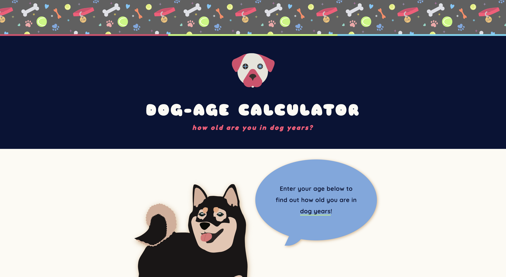
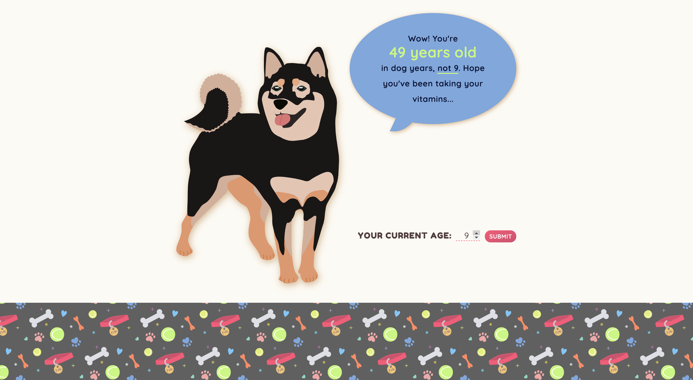
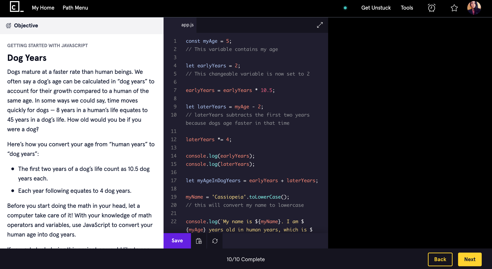

# Dog Age Calculator

## Table of Contents
 + [Introduction](#introduction)
 + [Features](#features)
 + [Favicon](#favicon)
 + [Tech Specs](#tech-specs)

## Introduction

  

 Using super-sophisticated canine math, [Dog Age Calculator](https://cassiopeian.github.io/dog-age-calculator/) converts your human age into dog years.

## Features

 

 Enter your age on the dotted pink line, and click submit. The updated speech bubble will: 
 + Reveal your dog age
 + Remind you of your human age
 + Generate a random quip

## Favicon 

 

 Also featured in the header, the favicon depicts a dog with addition and multiplication symbols in its eyes.

## Inspiration

 

 This project has its roots in a Codecademy lesson on the use of math operators and variables in JavaScript. The original project was limited to the console, but I wanted to build a visual interface. I designed a GUI with an input that accepts numbers, along with a *Submit* button that sends the output to the dog’s speech bubble.  

I also used this project to practice using `Math.random` to generate random responses from the dog I drew in Illustrator.

## Tech Specs

 Dog Age Calculator was built with jQuery version 3.4.1.